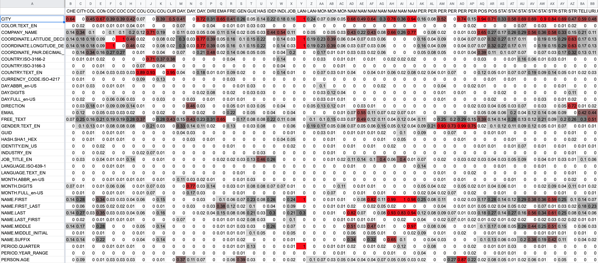

# Semantic Type Reference Set #

The file 'reference.csv' captures the 'truth' as it relates to the Semantic Types from the data files stored in the data directory.
All data files are currently sourced from socrata.com.

The intention is to select files at random to provide a robust corpus to objectively measure the performance of any process that attempts to determine
the Semantic Type of a data stream.  Prior analyses have attempted to use crowdsourcing (Mechanical Turk), column headers, etc to validate their process, however, this is clearly not as robust as having a source of 'truth' (see caveats below).

Notes:
 * This corpus currently only includes English, Spanish, and Dutch data.
 * For any given CSV file, there may be an associated csv.ignore which indicates that this file is not included in the reference.csv set.
 * For any given CSV file, there is an associated csv.options which contains options that should be used to interpret the CSV file (e.g. locale, delimiter, charset, ...).

## Reference Fields  ##

The Reference file has a set of attributes keyed by the name of the file (File) and the field offset (FieldOffset)
 * File - the name of the file processed
 * FieldOffset - the offset of the field within the record (0 origin)
 * Locale - the Locale of the file being processed
 * RecordCount - the number of records in the file
 * BaseType - one of Boolean, LocalDate, LocalDateTime, LocalTime, Long, OffsetDateTime, String, ZonedDateTime
 * TypeModifier - A modifier for the BaseType e.g. SIGNED, GROUPING, NON_LOCALIZED, ...
 * SemanticType - the identified Semantic Type if determined (See https://github.com/tsegall/fta - for a list of Semantic Types currently identified)
 * Notes - any notes to indicate observations made, typically to indicate why the field does not correspond to an expected Semantic Type

## F1-Score ##

Given a sample file 'current.csv' with the same layout as 'reference.csv' which is the output of any automated process that attempts to do automatic Semantic Type detection then the program performance will generate Precision, Recall, and F1-Scores by Semantic Type.

## Correlation ##

The program correlation will produce a correlation matrix for the Semantic Types detected for any give locale.  See example below. 

This information in conjunction with the associated proximity data (e.g. Distance and Direction) can be used to enhance Semantic Type detection.

## Usage ##

Please feel free to use this Corpus to measure the success of your process.  With the exception of the data files (data/**/*.csv) all files in this repository are covered by the Apache 2.0 license.  The data files are covered by the respective licenses from socrata.com - which for the current set is the 'Creative Commons 1.0 Universal (Public Domain Dedication)' license.

## Semantic Type Classification ##

The reference file which purports to be the arbiter of truth certainly has errors.  Some of these will be simple errors where fields have been incorrectly classified (if you see any,
feel free to raise an issue or better still a Pull Request), others may be the result of a close call.

